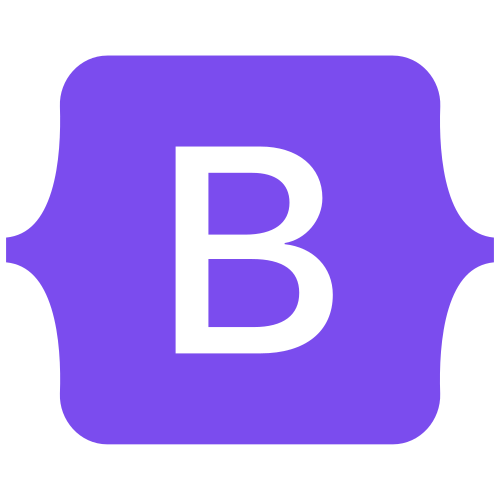
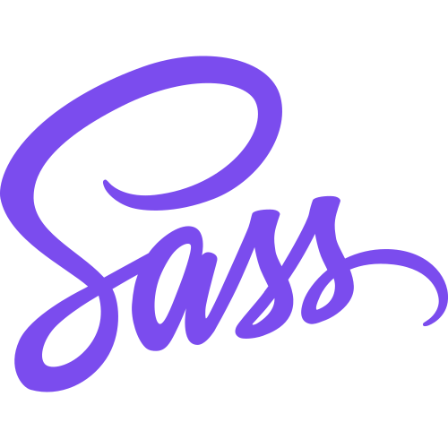
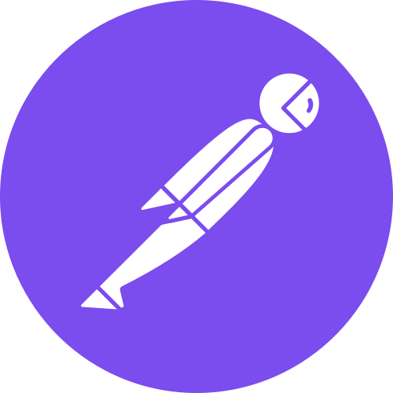
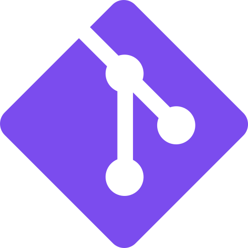
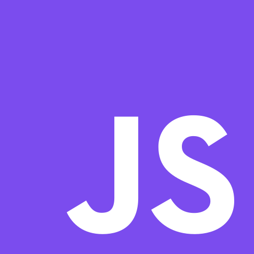
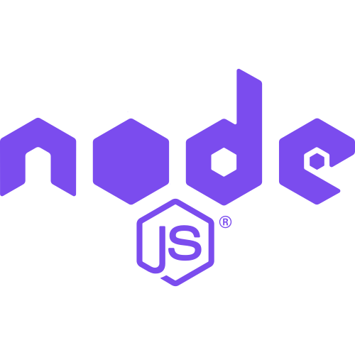

<h1 align="center">Hi 👋, I'm Halid</h1>
<h3 align="center">React Developer | Frontend Developer | Software Developer</h3>

<h3 align="left">Connect with me:</h3>

  
  
   

<h3 align="left">Languages and Tools:</h3>

  

   

   

   

   

   

   

   

   

   

   

  

  

  <a href="https://aws.amazon.com/tr/free/?gclid=Cj0KCQjw6uWyBhD1ARIsAIMcADqZi4os6-qUM_GWYrVQToA1k-oLOjn8s5p__UAglsWZU49FvTelM6gaAo6XEALw_wcB&trk=4afc2f2e-9eb0-4686-a253-878759f1feb9&sc_channel=ps&ef_id=Cj0KCQjw6uWyBhD1ARIsAIMcADqZi4os6-qUM_GWYrVQToA1k-oLOjn8s5p__UAglsWZU49FvTelM6gaAo6XEALw_wcB:G:s&s_kwcid=AL!4422!3!645208863499!e!!g!!aws!19580263879!144835121949&all-free-tier.sort-by=item.additionalFields.SortRank&all-free-tier.sort-order=asc&awsf.Free%20Tier%20Types=*all&awsf.Free%20Tier%20Categories=*all" target="_blank" rel="noreferrer">
    
  </a>

  

  
  <!-- Add other icons similarly -->

